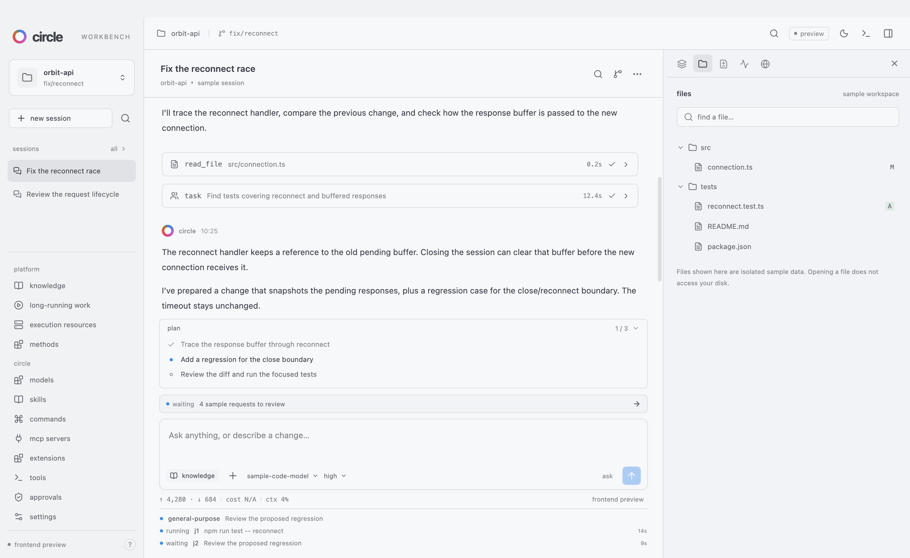

# Native frontend validation

Checked on 2026-10-11 (Asia/Tokyo), macOS arm64, Node.js 24 and Electron 44.7.0. The source baseline is Circle 1.0.4 at `9b532727e4433f2d0fa6a0d222a4509daf7f15e4`; the receipts bind the application sources and bundled bytes independently of a Git commit.

| Check | Result | Evidence |
|---|---|---|
| Existing CLI type check, tests and build | 360 tests passed; core `src/` unchanged | `npm run check`, isolated `CIRCLE_HOME` |
| Renderer state, source coverage and plugin contracts | 21 tests passed | `npm --prefix apps/workbench test` |
| Native URL, file grants and export policies | 6 tests passed | `npm --prefix apps/desktop test` |
| Development desktop application | 13 checks, no page errors | [Development receipt](validation/development-receipt.json) |
| Native Circle interface | 38 commands, 46 checks, no page errors | [Interface receipt](validation/interface-receipt.json) |
| Packaged `.app` | 13 checks, no page errors; packaged flag verified | [Packaged receipt](validation/packaged-receipt.json) |
| Application and disk image | Local `.app` and `.dmg` produced | [Artifact hashes](validation/artifact-receipt.json) |
| Formatting | Core and both application packages passed | Package `format:check` scripts |

The native checks launch actual Electron windows from the development entry point and from the packaged application. The renderer loads `circle://workbench`, with Node integration disabled, context isolation and sandboxing enabled. Selected-file reads, clipboard writes, export bytes, bounded workspace grants and native menu actions are checked through the host. A local HTTP fixture checks native browser navigation, stable session identity and a screenshot hash. Restart checks the saved conversation and pinned knowledge input.

The interface checks exercise every current slash command, draft persistence, separate input queues, secret discard, approval records, version pins, plugin disablement, custom keys, plan folding and a resized native window. The receipts list individual checks and SHA-256 values for source and build files. The packaged ASAR hash agrees with the packaging receipt. Screenshots show synthetic data only.

[Dark mode](validation/desktop-dark.png), [methods plugin](validation/desktop-methods.png) and [narrow window](validation/desktop-narrow.png) were also captured from native windows.

This validates the desktop frontend and its isolated preview services. It does not establish model or tool execution, real SSH effects, production B/C/D/E integration, production authorization or device compatibility. Other operating systems have packaging jobs; local native behavior results apply to this macOS run. The artifacts are development builds, not a signed public release.
